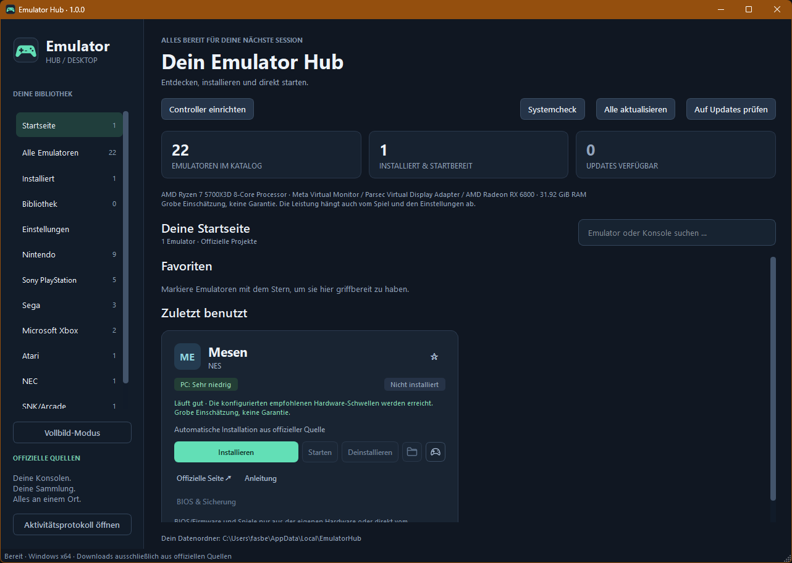
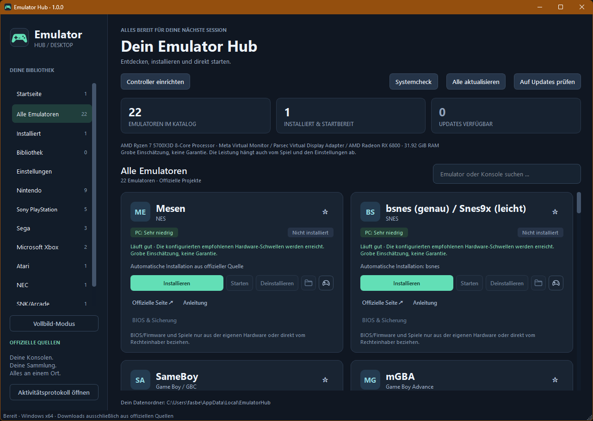

# Emulator Hub

Emulator Hub ist eine deutsche Desktop-Anwendung für Windows, die Emulatoren verwaltet und deine eigenen Spiel-Dateien organisiert. Die Oberfläche basiert auf Python 3.12 und PySide6 und bietet ein Dunkel-Design mit einem eigenen Controller-Logo.

## Funktionen

- 23 standardmäßig sichtbare Emulator-Einträge in acht Kategorien, einschließlich **Commodore / Amiga mit WinUAE**; 25 Katalogdatensätze bleiben insgesamt erhalten. Installation von offiziellen Quellen mit manueller Alternative und gemeinsame Emulator-Updateprüfung.
- Favoriten, zuletzt benutzte Emulatoren, lokale Spielebibliothek mit Suche, Filtern und Spiele-Ordnern.
- Grober CPU-/GPU-/RAM-Systemcheck mit anpassbaren Schwellen.
- Optionale Cover und Spielinfos über IGDB oder ScreenScraper, Offline-Cache und Zugangsdaten im Windows-Anmeldeinformationsmanager.
- Controller-Assistent mit XInput-Livetest; bestätigte automatische Belegung für Dolphin/GameCube-Port 1, sonst manuelle Anleitungen.
- Vollbild-/Couch-Modus mit Gamepad und Tastatur, BIOS-Prüfung eigener Dateien sowie Sicherung und Wiederherstellung von Spielständen und Einstellungen.
- Portabler Modus über `portable.flag`.

**PS4 ist vorübergehend ausgeblendet.** shadPS4 und PS4 PKG Tool bleiben im Katalog; **Einstellungen → Ausgeblendete Einträge anzeigen** ist standardmäßig aus und macht sie wieder sichtbar. Ausgeblendete Einträge fehlen auch in Suche, Systemcheck und Spielebibliothek und werden bei **Alle aktualisieren** übersprungen. Installierte Dateien, Einstellungen, Favoriten und eigene Spieleordner bleiben erhalten.

**WinUAE** wird aus dem aktuell stabilen Windows-x64-ZIP der [offiziellen Downloadseite](https://www.winuae.net/download/) automatisch installiert und auf Updates geprüft. Die Seite verlinkt die Programmdateien auf `download.abime.net/winuae/releases/`; Betas bleiben ausgeschlossen. Du brauchst ein eigenes lizenziertes oder selbst gesichertes Kickstart. Der Hub lädt, verlinkt oder bündelt keine Kickstart-ROMs, Spiele oder Workbench-Dateien. Eigene Amiga-Images sind über WinUAE-Konfiguration zu starten; vorbereitete `.uae`-Dateien können direkt geladen werden. [Amiga-Anleitung](docs/user-guide.md#amiga-mit-winuae).

Bei aktivierter Anzeige führt die PS4-Karte über **PS4 einrichten** zum externen [PS4 PKG Tool](https://github.com/pearlxcore/PS4PKGTool). Beim ersten Klick fragt der Hub vor dem offiziellen stabilen Download ausdrücklich nach Bestätigung und zeigt Quelle, SHA-256 und Drittanbieter-/Antivirus-Hinweis. Danach öffnet derselbe Button das Hauptfenster. Die Karte erklärt die fünf Schritte; shadPS4 und QTLauncher werden ausschließlich über **Tools > shadPS4 Manager** im Tool eingerichtet. **Ordner für Spiele-PKGs öffnen** öffnet den eigenen Paketordner. Das Tool benötigt derzeit die .NET-10-Desktop-Laufzeit und steht unter GPL-3.0.

Eigene `.pkg`-Dateien bleiben bei aktivierter Anzeige nicht startbare Bibliothekseinträge mit **Im PS4 PKG Tool installieren**. Die Dateiübergabe öffnet den PKG Viewer; die Installation erfolgt im Tool-Hauptfenster. Vorhandene shadPS4-Installationen bleiben als **veraltet** startbar und werden vom Hub nicht mehr installiert oder aktualisiert. Nutzerdaten bleiben erhalten. [Anleitung](docs/user-guide.md#eigene-ps4-pakete-mit-ps4-pkg-tool).

## Screenshots





## Download und Start

Die Windows-Pakete stehen im Bereich Releases dieses GitHub-Repositorys:

- `EmulatorHub-Setup.exe`: Installation für den aktuellen Benutzer, ohne Administratorrechte, mit Startmenü-Eintrag und optionalem Desktop-Icon.
- `EmulatorHub-<Version>-portable.zip`: vollständig entpacken und `EmulatorHub.exe` starten. Den kompletten Ordner einschließlich `_internal` behalten; `portable.flag` aktiviert lokale Daten unter `data`.
- `SHA256SUMS.txt`: Prüfsummen der veröffentlichten Dateien.

Windows SmartScreen kann bei unsignierten oder noch wenig verbreiteten Programmen eine Warnung anzeigen. Lade nur aus dem erwarteten Repository und vergleiche die Prüfsumme. Die Releases sind derzeit nicht digital signiert.

## Voraussetzungen

Windows 10/11 **x64**. Für Release-Pakete wird keine zusätzliche Python-Installation benötigt; Entwickler benötigen Python **3.12 x64**. Internet ist für Emulator-Downloads und optionale Cover-Abfragen nötig. Die Bibliothek und gecachte Infos funktionieren offline. Emulatoren haben eigene Hardware-, Runtime- und Einrichtungsanforderungen; der Systemcheck ist eine grobe Einschätzung ohne Garantie.

## Schnellstart für Entwickler

Im Projektordner:

```powershell
py -3.12 -m venv .venv
.\.venv\Scripts\python.exe -m pip install -r requirements.lock.txt
.\.venv\Scripts\python.exe main.py
```

Tests und Windows-Pakete:

```powershell
.\.venv\Scripts\python.exe -m unittest discover -s tests -t . -v
.\build.ps1
```

Der Build verwendet PyInstaller im **Ordner-Modus** und erzeugt zusätzlich eine portable ZIP. Mit installiertem Inno Setup entsteht auch ein Installer. Die Programmversion wird zentral in `core/version.py` gepflegt.

## Dokumentation und Beiträge

- [Handbuch und Einrichtung](docs/user-guide.md): alle Funktionen, eigene Daten, Cover-Konten, Controller, Logo und portabler Modus.
- [Entwicklung und Build](docs/development.md): Tests, Katalogimport, Paketierung und Projektstruktur.
- [GitHub-Veröffentlichung](docs/releasing.md): Git-Befehle, Versions-Tags und automatische Releases.
- [Katalogquellen](docs/catalog_sources.md), [Konfigurationsfelder](docs/new_catalog_fields.md) und [Verifikation](docs/verification.md).
- [Beiträge](CONTRIBUTING.md), [Änderungen](CHANGELOG.md), [MIT-Lizenz](LICENSE) und [Drittanbieter-Lizenzen](THIRD_PARTY_NOTICES.md).

## Rechtlicher Hinweis

Das Repository und die Release-Pakete enthalten **keine Emulatoren, PS4 PKG Tool, ROMs, Spiele, BIOS- oder Firmware-Dateien**. Emulatoren und das Hilfsprogramm werden bei ausdrücklicher Auswahl von ihren offiziellen Projektquellen geladen oder manuell zugeordnet und unterliegen ihren eigenen Lizenzen. Die Bibliothek speichert nur Pfade und Metadaten zu selbst bereitgestellten Dateien. Der Hub entschlüsselt und entpackt keine PS4-Pakete, enthält dafür keine Schlüssel oder Key-Dateien und verändert keinen Kopierschutz. Verwende nur Dateien, zu deren Nutzung du berechtigt bist.

Die MIT-Lizenz gilt für den eigenen Projektcode und das eigene Logo; Rechte an Drittanbieter-Software, Katalognamen, Coverbildern und Dienstinhalten bleiben bei den jeweiligen Rechteinhabern. Nintendo, Sony, Sega, Microsoft und andere genannte Namen gehören ihren Rechteinhabern. Emulator Hub ist ein unabhängiges Projekt und wird von diesen Unternehmen weder unterstützt noch empfohlen.
